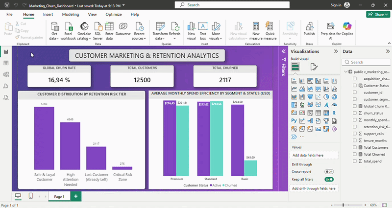

# Customer Marketing & Retention Analytics 📊🇺🇸

## 1. Project Overview & Business Value
This end-to-end analytics platform investigates customer churn behavioral metrics for a high-volume B2C e-commerce system. By integrating Python data cleansing, a permanent PostgreSQL storage layer, and an interactive Power BI frontend, this project bridges data engineering with commercial C-suite decision making.

**Key Financial Insight:** The architecture reveals a massive **Financial Efficiency Gap within the Basic Customer Segment**. Active users generate substantial lifetime metrics, while churned users collapse under critical thresholds.

---

## 2. Interactive Performance Demo
Below is a live interaction capture of the production dashboard, showcasing dynamic filtering across high-risk retention zones and customer value tiers.



---

## 3. Data Engineering & Core SQL Architecture
The core business intelligence logic is engineered directly within the PostgreSQL server as a permanent database view (`v_marketing_retention_analytics`). This guarantees real-time automated data refreshes without straining Power BI memory.

```sql
CREATE OR REPLACE VIEW public.v_marketing_retention_analytics AS
SELECT 
    "CustomerID" AS customer_id,
    "CustomerSegment" AS customer_segment,
    "AcquisitionChannel" AS acquisition_channel,
    "TenureMonths" AS tenure_months,
    "SupportCalls" AS support_calls,
    "TotalSpend_USD" AS total_spend,
    
    -- Segmenting customers by behavioral churn risk tiers
    CASE 
        WHEN "ChurnStatus" = 1 THEN 'Churned'
        ELSE 'Active'
    END AS customer_status,
    
    -- Advanced behavioral categorization
    CASE 
        WHEN "ChurnStatus" = 1 THEN 'Lost Customer (Already Left)'
        WHEN "SupportCalls" >= 5 AND "CustomerSegment" = 'Basic' THEN 'Critical Risk Zone'
        WHEN "SupportCalls" >= 4 THEN 'High Attention Needed'
        ELSE 'Safe & Loyal Customer'
    END AS retention_risk_tier,
    
    -- Spend Efficiency (Average dollar metric per active month)
    CASE 
        WHEN "TenureMonths" > 0 THEN ROUND(CAST("TotalSpend_USD" / "TenureMonths" AS numeric), 2)
        ELSE 0
    END AS monthly_spend_efficiency
FROM public.marketing_churn_raw;
```

---

## 4. Key Executive Metrics (DAX Core)
The frontend layer leverages precise DAX measures to track operational health:
* **Global Churn Rate:** `16.94%` (Critical warning threshold)
* **Total Customer Base:** `12,500` active profiles
* **Total Churned Accounts:** `2,118` lost profiles

---

## 5. Strategic Recommendations for the C-Suite
1. **Automate Basic Risk Interventions:** Implement instant automated loyalty triggers for any `Basic` segment profile whose `Monthly Spend Efficiency` drops below standard deviations.
2. **Prioritize High-Attention Premium Accounts:** Flag all premium accounts with 4+ customer support hangups directly in CRM to prevent massive high-ticket revenue loss.
