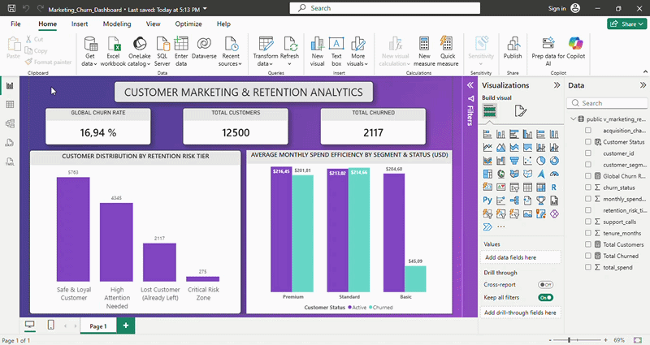

# Customer Marketing & Retention Analytics

[](https://github.com/jurajpijakdata/Projekt_Marketing_Analytics/actions/workflows/tests.yml)



An end-to-end data engineering pipeline that simulates customer behavior for a B2C subscription business, cleans and validates it, loads it into a relational warehouse, and builds a retention-risk reporting layer on top -- the kind of pipeline that would sit behind a churn dashboard.

All data in this project is synthetically generated with a fixed random seed, so results are fully reproducible without using any real customer data.

## How it's built

**Idempotent loads.** The pipeline uses `INSERT ... ON CONFLICT (CustomerID) DO UPDATE` instead of `replace` or blind `append`, so it can be re-run on the same data without creating duplicates.

**One source of truth for the transformation logic.** Spend parsing and retention-risk classification both live in a single tested module (`marketing_parser.py`), imported by both `marketing_ingestion.py` and `marketing_bi_layer.py`, so a given raw value or customer record is interpreted the same way no matter which script touches it.

**Locale-aware number parsing.** `clean_numeric_spend` handles both US-style figures ("2,500.75") and a plain European decimal comma ("1234,56"). A lone comma with no decimal point is genuinely ambiguous between the two conventions, so it's disambiguated by digit count (two digits after the comma reads as cents; anything else is treated as a thousands separator) rather than guessed at -- a naive guess would silently turn a plain thousands-formatted number like "1,234" into 1.234.

**Quarantine over silent failure.** Rows with unparseable spend or support-call data get `NULL` and a `data_quality_status = 'UNKNOWN'` flag instead of a false zero. If more than 5% of a run's rows fail validation, the pipeline stops and exits non-zero rather than loading a bad batch quietly. A customer whose support-call count was quarantined this way is also called out explicitly in the retention-risk tier ("Unknown Risk (Incomplete Data)") instead of being silently folded into the low-risk bucket.

**Schema validation.** `pandera` checks the shape and types of the data before anything is written downstream.

**Tested business logic.** The parsing and classification logic is isolated in its own module and covered by a parametrized pytest suite, plus integration tests that run the ingestion and BI scripts end to end against a clean environment. Tests run automatically in CI on every push (see the badge above).

**Bulk loads.** The load step batches rows into chunked bulk upserts (1,000 rows per round-trip) rather than issuing one database call per row.

## Dataset

`marketing_data_gen.py` deterministically generates 12,500 synthetic customer records (seeded, so re-running it produces byte-identical output), with injected missing values and text corruption to exercise the self-healing/quarantine logic. The full dataset is committed to `data_raw/customer_churn_dataset.csv` so the repo runs immediately without regenerating it; re-run the generator only if you want to confirm the reproducibility yourself. `data_raw/customer_churn_dataset_sample.csv` (100 rows) is used as fixture data for the fast integration test suite, so tests don't have to process the full 12,500-row file on every run.

Two figures worth calling out about the generated data: the global churn rate lands at 16.94% (verified against the actual generated file), and customers in the `Basic` segment with 5+ support calls churn at **82.2%** -- a very deliberate signal, since the generator assigns that group an explicit 82% churn probability.

## Database layer

`create_tables.sql` creates the `marketing_churn_raw` table and a Row-Level Security policy for the `authenticated` Supabase role. Run it once against a fresh Postgres/Supabase database before pointing `marketing_ingestion.py` at real credentials.

## Repository structure

```text
Projekt_Marketing_Analytics/
├── data_raw/
│   ├── customer_churn_dataset.csv          # Full generated dataset (12,500 rows)
│   └── customer_churn_dataset_sample.csv   # 100-row fixture used by the integration tests
├── marketing_parser.py                     # Parsing & classification logic (unit tested)
├── marketing_data_gen.py                   # Deterministic synthetic data generator
├── marketing_ingestion.py                  # Loads validated data into Postgres (or local SQLite fallback)
├── marketing_bi_layer.py                   # Builds the retention-risk reporting table from the loaded data
├── test_marketing.py                       # Pytest suite for marketing_parser.py
├── test_marketing_pipeline.py              # Integration tests that run the pipeline end to end
├── create_tables.sql                       # Postgres schema and RLS policy
├── requirements.txt                        # Pinned dependencies
├── .github/workflows/tests.yml             # CI: runs the test suite on every push/PR
├── LICENSE
└── README.md
```

## Quick start

### 1. Install dependencies

```bash
pip install -r requirements.txt
```

### 2. Run the test suite

```bash
pytest -v
```

### 3. (Optional) Configure database credentials

Copy `.env.example` to `.env` and fill in your Supabase/Postgres connection details, then run `create_tables.sql` against that database once.

If you skip this step, `marketing_ingestion.py` automatically falls back to a local SQLite database, so you can run everything end to end with no cloud credentials.

### 4. Run the pipeline

```bash
python marketing_ingestion.py
python marketing_bi_layer.py
```

Loads the dataset into your configured database (or the local SQLite fallback), then builds the `v_marketing_retention_analytics` reporting table on top of it.

### 5. (Optional) Regenerate the dataset

```bash
python marketing_data_gen.py
```

Not required to run the pipeline -- the generated dataset is already committed -- but useful to confirm the generator is fully deterministic.

## Data protection note

This project uses only synthetic, randomly generated data -- no real customer information is processed anywhere in the pipeline.

---
*Engineered under the UpDataLogic framework for transparent, honest, and reproducible analytics pipelines.*
